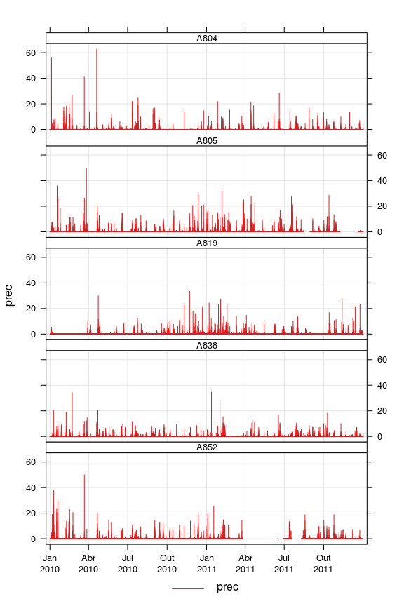

# Diagnóstico de problemas na estrutura dos dados de 2010-2011.
Jonatan Tatsch  
`r Sys.Date()`  

Os arquivos de dados horários das Estações Metorológicas Automáticas (EMA) do 
INMET são disponibilizados em formato texto (ASCII). É comum em dados 
armazenados em formato texto, mesmo temporariamente, que algum procedimento de 
formatação manual seja realizada.

A estrutura de armazenamento de dados mais comum em arquivos texto com dados 
meteorológicos é a retangular, onde as observações ao longo das linhas e as 
variáveis ao longo das colunas. Eventualmente, os arquivos são editados 
manualmente e esse padrão pode ser quebrado, mesmo despropositalmente. 
Então uma da observação (linha) pode não conter os campos de todas as
variáveis meteorológicas (colunas). 

Analogamente, podem ocorrer descontinuidades temporais nas observações. 
Por exemplo, a observação na linha seguinte ao horário `2000-01-01 16:00:00` 
pode ser referente ao horário `2000-01-01 19:00:00`, ou seja há 2 horários
faltantes entre essas 2 observações. Logo os dados não estão regularmente 
espaçados no tempo.

Para garantir um conjunto de dados temporalmente consistente
os horários faltantes devem explicitamente inseridos na variável temporal 
adequada (e.g. `date`) e as variáveis meteorológicas (colunas) preenchidas com
um valor definido para identificar dados faltantes (e.g: `NA`, `-9999`). 
Dessa forma, cada ano de dados ter-se-á 365 (ou 366) dias/ano $\times$ 
24 horas/dia $=$ 8760  (8784) observações.

A seguir mostra-se como usar o pacote `inmetwrangler` para importar os dados
das EMA do iNMET e diagnosticar onde (arquivos, linhas e colunas) ocorrem estes 
problemas. Esta informação pode servir para verificação dos dados com a agência
que forneceu os dados, para descartar a hipótese de algum problema na extração 
dos dados ou na operação manual dos arquivos texto.

## Pré-requisitos

Instalação do pacote `inmetwrangler`:


```r
library(devtools)
install_github("lhmet/inmetwrangler")
library(inmetwrangler)
```

Outros pacotes necessários para reproduzir os exemplos mostrados a seguir:


```r
library(knitr)
library(readr)
library(openair)
```


## Dados

Os dados dos exemplos abaixo são disponibilizados com o próprio pacote 
`inmetwrangler`, no diretório de instalação do pacote. Os arquivos 
disponibilizados são:


```r
#.libPaths()
# arquivos disponíveis
list.files(system.file("extdata", package = "inmetwrangler"
                       #, full.names = TRUE)
))
```

```
## [1] "A804.txt" "A805.txt" "A819.txt" "A838.txt" "A852.txt"
```


O caminho para um arquivo de dados pode ser obtido da seguinte forma:


```r
system.file("extdata", "A838.txt", package = "inmetwrangler")
```


```
## 
## Attaching package: 'dplyr'
```

```
## The following objects are masked from 'package:stats':
## 
##     filter, lag
```

```
## The following objects are masked from 'package:base':
## 
##     intersect, setdiff, setequal, union
```

```
## [1] "/home/hidrometeorologista/Dropbox/github/my_reps/lhmet/inmetwrangler/inst/extdata/A838.txt"
```

### Arquivos com cabeçalho variável

Os arquivos de dados horários das EMA tem um cabeçalho que pode ocupar de 2 
a 4 linhas. Essa variação no formato dos arquivos pode ser devido a forma como
os dados foram extraídos do banco de dados ou dependente do técnico reponsável 
pelo banco de dados.

Os arquivos disponibilizados com o pacote são exemplos de arquivos com 
diferentes cabeçalhos^[O cabeçalho inclui o comando `SQL` usado para 
extração dos dados a partir do banco de dados.]. 

- Arquivo com 4 linhas de cabeçalho sendo a 1ª observação apendada na última
linha do cabeçalho


```r
ex_file_h4 <- system.file("extdata", "A819.txt", package = "inmetwrangler")
head(read_lines(ex_file_h4))
```

```
[1] "<html><head>"                                                                                                                                                                                                 
[2] "<meta http-equiv=\"content-type\" content=\"text/html; charset=windows-1252\"></head><body>Sql"                                                                                                               
[3] " - SELECT * FROM cadRema WHERE RemaEstacao='a819'  and RemaData BETWEEN "                                                                                                                                     
[4] "'2010-01-01' AND '2011-12-31' ORDER BY RemaEstacao,RemaData,RemaHora <br><pre>A819 2010 01 01 00 12.3 21 19.3 19.4 19.2 88 89 86 17.3 17.3 17.0 902.5 902.5 902.0 3.4 107 7.3 -2.510 0.0 / //// ///// ///// ="
[5] "A819 2010 01 01 01 12.3 21 19.0 19.3 19.0 90 90 87 17.2 17.3 17.1 903.2 903.2 902.5 2.0 115 8.2 -2.320 0.0 / //// ///// ///// ="                                                                              
[6] "A819 2010 01 01 02 12.3 20 18.6 19.0 18.6 90 90 89 16.9 17.3 16.9 903.3 903.4 903.2 2.6 127 6.7 -2.433 0.0 / //// ///// ///// ="                                                                              
```

- Arquivo com 3 linhas de cabeçalho seguida de uma linha (4ª) em branco


```r
ex_file_h3 <- system.file("extdata", "A804.txt", package = "inmetwrangler")
head(read_lines(ex_file_h3))
```

```
[1] "Sql - SELECT * FROM cadRema WHERE RemaEstacao='a804' and RemaData"                                                              
[2] "BETWEEN '2010-01-01' AND '2011-12-31' ORDER BY"                                                                                 
[3] "RemaEstacao,RemaData,RemaHora"                                                                                                  
[4] ""                                                                                                                               
[5] "A804 2010 01 01 00 11.7 22 20.2 21.2 20.2 71 72 68 14.9 15.1 14.9 976.2 976.2 975.5 4.6 116 8.1 -3.540 0.0 / //// ///// ///// ="
[6] "A804 2010 01 01 01 11.6 20 19.4 20.3 19.3 77 77 71 15.2 15.2 14.9 976.3 976.4 976.2 4.8 105 8.4 -3.540 0.0 / //// ///// ///// ="
```

- Arquivo com 1 linha de cabeçalho seguida de uma linha (2ª) em branco


```r
ex_file_h2 <- system.file("extdata", "A852.txt", package = "inmetwrangler")
head(read_lines(ex_file_h2))
```

```
[1] "Sql - SELECT * FROM cadRema WHERE RemaEstacao='A852' and RemaData BETWEEN '2010-01-01' AND '2011-12-31' ORDER BY RemaEstacao,RemaData,RemaHora "
[2] ""                                                                                                                                               
[3] "A852 2010 01 01 00 12.5 28 24.5 26.0 24.5 54 54 50 14.6 14.7 14.6 982.7 982.7 982.3 4.4 105 8.3 -3.540 0.0 / //// ///// ///// ="                
[4] "A852 2010 01 01 01 12.5 26 23.2 24.5 23.2 60 60 54 15.0 15.0 14.7 983.1 983.2 982.7 5.0 106 9.7 -3.540 0.0 / //// ///// ///// ="                
[5] "A852 2010 01 01 02 12.5 25 22.3 23.2 22.3 63 64 60 15.0 15.0 15.0 983.5 983.6 983.2 4.2 103 9.7 -3.540 0.0 / //// ///// ///// ="                
[6] "A852 2010 01 01 03 12.5 24 21.9 22.3 21.9 65 65 63 15.1 15.1 14.9 983.5 983.6 983.4 4.6 100 8.8 -3.540 0.0 / //// ///// ///// ="                
```

## Detectando problemas

A função `import_txt_files_inmet()` além de importar os arquivos de dados 
horários considerando os diferentes cabeçalhos dos arquivos, também é usada para
diagnosticar problemas na estrutura dos dados.

### Caso 1: menos variáveis do que o esperado

Conforme [nota técnica do INMET](http://www.inmet.gov.br/portal/css/content/topo_iframe/pdf/Nota_Tecnica-Rede_estacoes_INMET.pdf) os arquivos devem conter 23 variáveis meteorológicas (especificadas na seção IMPORTANDO DADOS), uma com identificador da EMA e 4 com informação do ano, mês, dia e hora (UTC); totalizando 28 colunas. Mas nos arquivos ASCII fornecidos há uma coluna adicional com o símbolo "=". Então o total esperado de colunas nos arquivos texto é de 29 colunas.


```r
myfile <- system.file("extdata", "A838.txt", package = "inmetwrangler")
A838_problems <- import_txt_files_inmet(files = myfile, 
                                        verbose = FALSE,
                                        only.problems = TRUE, 
                                        full.names = TRUE)
kable(A838_problems)
```


  row  col   expected     actual       file                                                                                          row_file
-----  ----  -----------  -----------  -------------------------------------------------------------------------------------------  ---------
 9712  NA    29 columns   14 columns   /home/hidrometeorologista/Dropbox/github/my_reps/lhmet/inmetwrangler/inst/extdata/A838.txt        9714
 9741  NA    29 columns   24 columns   /home/hidrometeorologista/Dropbox/github/my_reps/lhmet/inmetwrangler/inst/extdata/A838.txt        9743

A tabela de dados mostrada é auto-explicativa, mas é importante notar a diferença entre `row` (linha nos dados importados no R) e `row_file` (linha no arquivo ASCII). Foram encontradas 2 observações com menor n° de variáveis que o esperado.
Esperavam-se 29 variáveis para a observação da linha 9712 (9741), entretanto, o arquivo contém apenas 14 (24) variáveis naquela linha.

Para verificar no arquivo original é possível abri-lo em um editor de texto, ou executar os comandos abaixo em que importamos o arquivo da EMA de interesse (`myfile`) e filtrarmos os dados entre uma linha acima (`ir - 1`) e uma abaixo (`ir + 1`) da linha com problema (`ir`). 


```r
for (i in 1:nrow(A838_problems)) {
  cat(" ------------", "Problem ", i, " ------------", "\n")
  ir <- A838_problems$row_file[i]
  print(read_lines(file = myfile)[(ir - 1):(ir + 1)])
}
```

```
 ------------ Problem  1  ------------ 
[1] "A838 2011 02 25 15 12.0 34 29.2 ///// ///// 74 /// /// 24.2 ///// ///// 999.3 ////// ////// 0.7 166 //// 831.986 0.0 / //// ///// ///// =" 
[2] "A838 2011 02 25 16 12.0 34 28.0 ///// ///// 77 /// /// ="                                                                                  
[3] "A838 2011 02 26 13 11.9 25 24.2 ///// ///// 85 /// /// 21.5 ///// ///// 1002.7 ////// ////// 2.6 186 //// 457.911 0.0 / //// ///// ///// ="
 ------------ Problem  2  ------------ 
[1] "A838 2011 03 01 15 13.1 26 23.5 23.6 21.8 70 81 69 17.7 19.3 17.3 1007.0 1007.3 1007.0 2.6 119 7.5 1509.010 0.0 / //// ///// ///// ="
[2] "A838 2011 03 01 16 12.2 28 23.2 ///// ///// 67 /// /// 16.8 ///// ///// 1006.7 ////// ////// //// /// //// 59 ="                     
[3] "A838 2011 03 01 17 13.0 30 24.6 25.1 23.2 62 67 59 17.0 17.6 15.9 1006.2 1006.7 1006.2 2.3 110 8.7 2451.034 0.0 / //// ///// ///// ="
```

### Caso 2: mais variáveis do que o esperado


```r
myfile <- system.file("extdata", "A852.txt", package = "inmetwrangler")
myfile
```

[1] "/home/hidrometeorologista/Dropbox/github/my_reps/lhmet/inmetwrangler/inst/extdata/A852.txt"

```r
A852_problems <- import_txt_files_inmet(files = myfile, 
                                        verbose = FALSE,
                                        only.problems = TRUE)
kable(A852_problems)
```


   row  col   expected     actual       file        row_file
------  ----  -----------  -----------  ---------  ---------
 10759  NA    29 columns   34 columns   A852.txt       10761
 10760  NA    29 columns   34 columns   A852.txt       10762
 10761  NA    29 columns   34 columns   A852.txt       10763
 10762  NA    29 columns   34 columns   A852.txt       10764
 10763  NA    29 columns   34 columns   A852.txt       10765
 10764  NA    29 columns   34 columns   A852.txt       10766
 10765  NA    29 columns   34 columns   A852.txt       10767
 10766  NA    29 columns   34 columns   A852.txt       10768
 10767  NA    29 columns   34 columns   A852.txt       10769
 10768  NA    29 columns   34 columns   A852.txt       10770
 10769  NA    29 columns   34 columns   A852.txt       10771
 10770  NA    29 columns   34 columns   A852.txt       10772
 10771  NA    29 columns   34 columns   A852.txt       10773
 10772  NA    29 columns   34 columns   A852.txt       10774
 10773  NA    29 columns   34 columns   A852.txt       10775
 10774  NA    29 columns   34 columns   A852.txt       10776
 10775  NA    29 columns   34 columns   A852.txt       10777
 10776  NA    29 columns   34 columns   A852.txt       10778

Foram encontradas 18 observações com mais variáveis do que o esperado (29). Essas linhas são consecutivas, desde a linha 10761 no arquivo original até a linha 10778.


## Importando os arquivos de dados

A função `import_txt_files_inmet()` importa arquivos de dados 
horários dando conta das diferenças de cabeçalhos dos arquivos e preenche (ou remove) as variáveis de uma observação com campos incompletos (excedentes).


```r
txt_files <- list.files(system.file("extdata", 
                                package = "inmetwrangler"),
                    full.names = TRUE)
txt_files
```

[1] "/home/hidrometeorologista/Dropbox/github/my_reps/lhmet/inmetwrangler/inst/extdata/A804.txt"
[2] "/home/hidrometeorologista/Dropbox/github/my_reps/lhmet/inmetwrangler/inst/extdata/A805.txt"
[3] "/home/hidrometeorologista/Dropbox/github/my_reps/lhmet/inmetwrangler/inst/extdata/A819.txt"
[4] "/home/hidrometeorologista/Dropbox/github/my_reps/lhmet/inmetwrangler/inst/extdata/A838.txt"
[5] "/home/hidrometeorologista/Dropbox/github/my_reps/lhmet/inmetwrangler/inst/extdata/A852.txt"

```r
# merge data files
hdata <- import_txt_files_inmet(files = txt_files, verbose = FALSE)
kable(head(hdata[, 1:10]))
```


site   date                   tens_bat   temp_cpu   tair_inst   tair_max   tair_min   rh_inst   rh_max   rh_min
-----  --------------------  ---------  ---------  ----------  ---------  ---------  --------  -------  -------
A804   2010-01-01 00:00:00        11.7         22        20.2       21.2       20.2        71       72       68
A804   2010-01-01 01:00:00        11.6         20        19.4       20.3       19.3        77       77       71
A804   2010-01-01 02:00:00        11.6         19        18.8       19.4       18.8        79       79       77
A804   2010-01-01 03:00:00        11.6         19        18.0       18.8       18.0        77       79       76
A804   2010-01-01 04:00:00        11.6         18        16.6       18.0       16.6        77       78       76
A804   2010-01-01 05:00:00        11.5         17        15.9       16.6       15.9        75       77       74

```r
kable(tail(hdata[, 1:10]))
```


site   date                   tens_bat   temp_cpu   tair_inst   tair_max   tair_min   rh_inst   rh_max   rh_min
-----  --------------------  ---------  ---------  ----------  ---------  ---------  --------  -------  -------
A852   2011-12-31 18:00:00        13.2         34        26.8       32.1       26.8        51       51       38
A852   2011-12-31 19:00:00        13.4         32        29.9       29.9       26.3        44       55       43
A852   2011-12-31 20:00:00        13.5         32        26.3       30.4       25.7        54       58       39
A852   2011-12-31 21:00:00        12.6         31        25.3       26.9       25.3        59       60       53
A852   2011-12-31 22:00:00        12.6         29        24.0       25.8       24.0        67       67       60
A852   2011-12-31 23:00:00        12.5         27        23.2       24.4       23.1        66       69       64


## Gráficos

The figure sizes have been customised so that you can easily put two images side-by-side. 


```r
nsites <- length(unique(hdata$site))
timePlot(hdata, 
         "prec", 
         type = "site", 
         plot.type = "h", 
         layout = c(1, nsites),
         date.format = "%b\n%Y")
```

<div class="figure" style="text-align: center">

<p class="caption">Séries horárias de Precipitação.</p>
</div>


